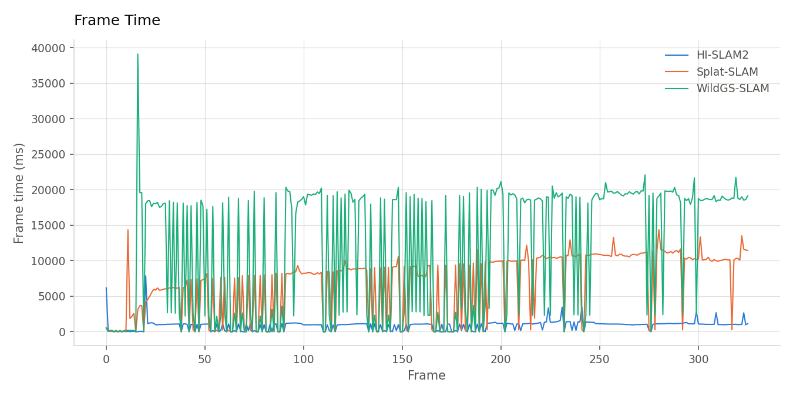
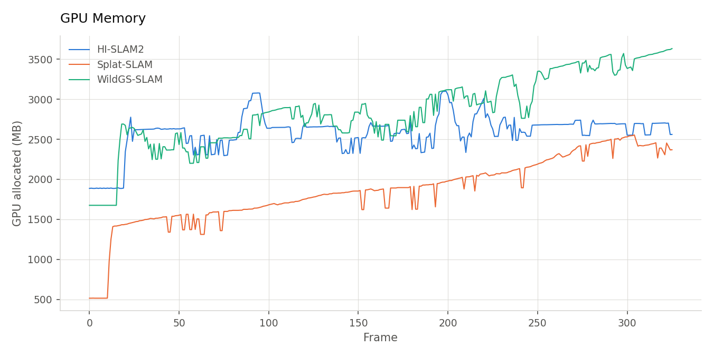
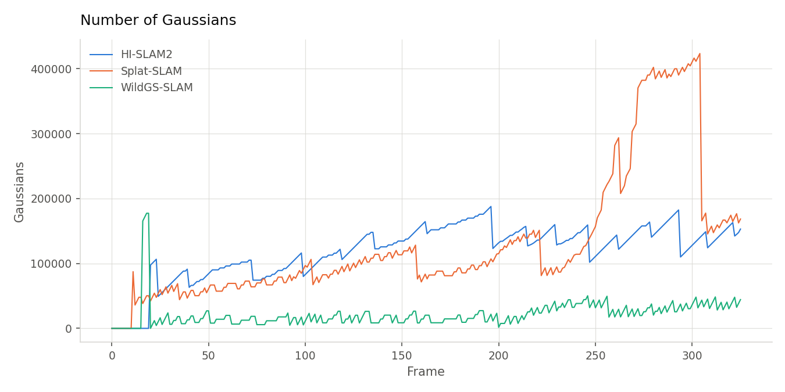
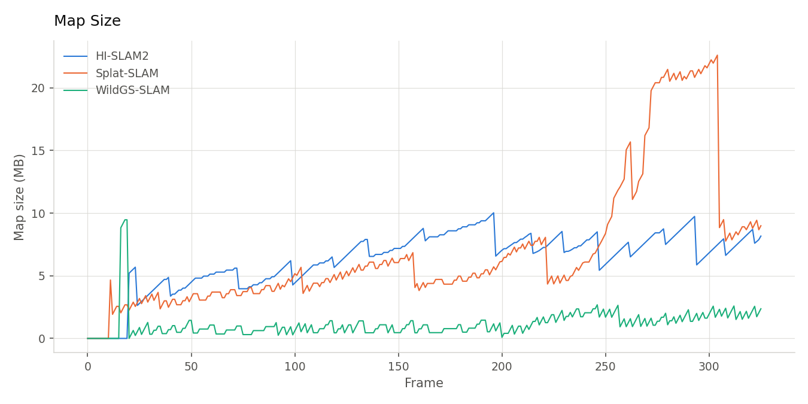
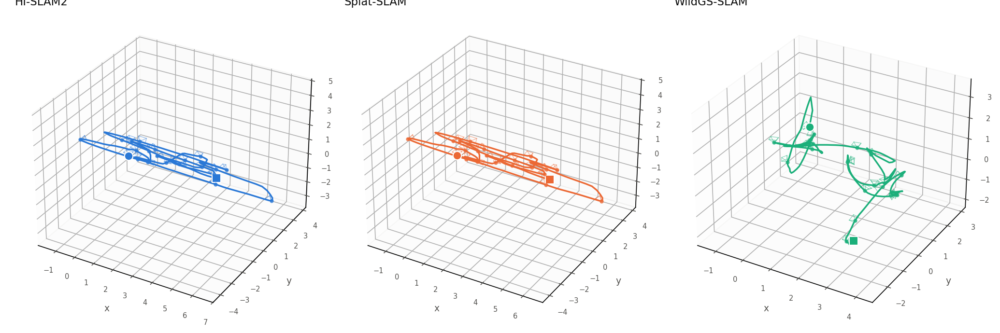
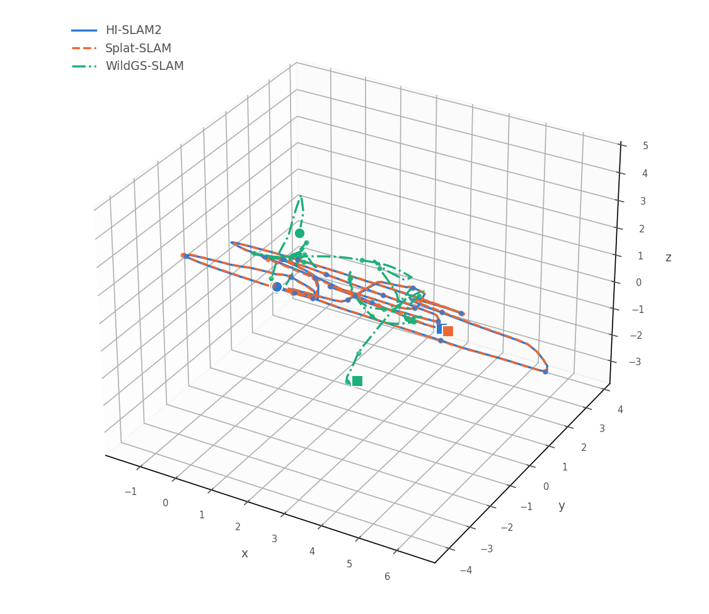

## Gaussian-SLAM Comparison Report

We present a simple comparison report of three monocular Gaussian-SLAM systems:

- [HI-SLAM2](https://github.com/Layer-42/HI-SLAM2)
- [Splat-SLAM](https://github.com/Layer-42/Splat-SLAM)
- [WildGS-SLAM](https://github.com/Layer-42/WildGS-SLAM)

The goal is to run all three systems on Waldek RGB sequences and compare their final Gaussian maps, rendering quality, and behavior in tracking, loop closure, and dynamic scenes.

- **HI-SLAM2**:  focuses on geometry-aware mapping using depth and normal priors.
- **Splat-SLAM**: emphasizes globally optimized RGB-only SLAM.
- **WildGS-SLAM**: is designed to better handle dynamic environments and moving objects.

### Host Requirements

Use a Linux machine with:

- NVIDIA GPU and driver
- Docker
- X11 if GUI or live visualization is required

All three Docker setups use CUDA 11.8. HI-SLAM2 also builds COLMAP 3.8 inside its image for calibration

### Clone the repositories

Clone each repository recursively so that its submodules are available:

```bash
cd /path/to/workspace

git clone --recursive https://github.com/Layer-42/HI-SLAM2.git
git clone --recursive https://github.com/Layer-42/Splat-SLAM.git
git clone --recursive https://github.com/Layer-42/WildGS-SLAM.git
```

The commands below assume this directory layout:

```text
/path/to/workspace/
├── HI-SLAM2/
├── Splat-SLAM/
└── WildGS-SLAM/
```

All 3 Docker setups use CUDA 11.8 and follow the same general procedure for building and running the containers.

### 1. HI-SLAM2

#### Build

External paths used by the Docker containers are defined in the `.env` files of each repository.

```bash
cd /path/to/workspace/HI-SLAM2

cp .env.example .env
docker compose build
docker compose run --rm hislam2 
```

The default `.env` values are:

```dotenv
SLAM_DATA_DIR=./data
SLAM_OUTPUT_DIR=./outputs
SLAM_PRETRAINED_DIR=./pretrained_models
COLMAP_VERSION=3.8
CUDA_ARCHITECTURES=75;80;86;89
```

The HI-SLAM2 Compose service is named `hislam2`.

Remark: The image installs COLMAP for camera intrinsics and calibration.

#### Download pretrained models

Run the model-download script from the HI-SLAM2 repository. The script is idempotent and skips files that already exist.

```bash
bash scripts/download_models.sh
```

The models are saved under `pretrained_models/`:

```text
pretrained_models/omnidata_dpt_normal_v2.ckpt
pretrained_models/omnidata_dpt_depth_v2.ckpt
pretrained_models/droid.pth
```

#### Custom RGB dataset (Waldek Data)

To process the RGB Video dataset, we need to extract a sequence of frames and estimate the camera intrinsics of the capturing device.

We use the HI-SLAM2 preprocessing script with FPS `target_fps=1` and `max_size=584`. For the Waldek source aspect ratio, this generates `584x328` images (`width x height`) after rounding both dimensions down to multiples of 8:

```bash
# preprocess
python scripts/preprocess_owndata.py \
  "${VIDEO}" \
  "${DATA_DIR}" \
  1 \
  584

# symbolic links for wildgs 
ln -s "${DATA_DIR}/images" "${DATA_DIR}/rgb"

- `${VIDEO}` should be the path to your source video.
- `${DATA_DIR}` should be the path to the directory where you want to store the extracted frames and calibration files.
```

We get:

- `images/` containing the extracted frames.
- `calib.txt` containing the camera calibration.
- `colmap.db` containing the COLMAP database.
- `sparse/` containing the sparse reconstruction.
- `sparse_txt/` containing the sparse reconstruction in text format.

Preview:

```text
# Camera list with one line of data per camera:
#   CAMERA_ID, MODEL, WIDTH, HEIGHT, PARAMS[]
# Number of cameras: 1
1 OPENCV 584 328 427.81303963780397 423.84460163652602 290.82645355334381 162.18735027378105 0.080567308476378705 -0.07948273851914954 0.00056333583456826995 0.00025556892687264441
```

Note:

- We modified the preprocessing script to get image width and height as multiples of 8, This ensures compatibility with used architectures in all SLAM systems.

- Same parameters will be used in the Splat-SLAM and WildGS-SLAM configurations to ensure consistency across all three systems.

- HI-SLAM2 keeps `RES = 384 * 512` in `demo.py`. This is an aspect-ratio-preserving pixel budget with dimensions rounded to multiples of 8, not a literal `384x512` resize.

#### Configuration

We use `config/waldek_performance.yaml` as the base configuration for the custom dataset.

For HI-SLAM2, the intrinsic parameters are specified `calib.txt` and can be directly read from it.

#### Run

Run HI-SLAM2 with the shared frames and the calibration generated by its preprocessing script:

```bash
cd /path/to/workspace/HI-SLAM2

# run HI-SLAM2 docker container
docker compose run --rm hislam2

# run slam pipeline
python demo.py \
    --imagedir datasets/waldek_data/images \
    --calib datasets/waldek_data/calib.txt \
  --config config/waldek_performance.yaml \
    --output outputs \
  --scene waldek_data \
  --undistort
```

HI-SLAM2 saves its final Gaussian map and rendering results under:

```text
outputs/
├── final_gs.ply
├── psnr/
│   └── <iteration>/
│       └── final_result.json
├── traj/
└── ...
```

### WildGS-SLAM

#### Build

```bash
cd /path/to/workspace/WildGS-SLAM

cp .env.example .env
docker compose build
docker compose run --rm wildgs
```

The default `.env` values are:

```dotenv
SLAM_DATA_DIR=./datasets
SLAM_OUTPUT_DIR=./output
SLAM_PRETRAINED_DIR=./pretrained
```

The WildGS-SLAM Compose service is named `wildgs`.

#### Download pretrained models

```bash
bash scripts/download_models.sh
```

#### Configuration

Use `configs/Custom/waldek_performance.yaml` for the processed Waldek dataset. GUI and online plotting are disabled; `fast_mode` is enabled for the requested WildGS-SLAM performance profile.

```yaml
inherit_from: ./configs/wildgs_slam.yaml
scene: waldek_data 

dataset: "wild_slam_iphone"
data:
  input_folder: ${WILDGS_DATA_DIR}/waldek_data
  output: ./output/Custom

cam:
  H: 328
  W: 584
  H_out: 328
  W_out: 584
  fx: 427.81303963780397
  fy: 423.84460163652602
  cx: 290.82645355334381
  cy: 162.18735027378105
  distortion:
    [
      0.080567308476378705,
      -0.07948273851914954,
      0.00056333583456826995,
      0.00025556892687264441,
    ]

tracking:
  buffer: 400
  motion_filter:
    thresh: 3.0

  frontend:
    keyframe_thresh: 4.0
    window: 25 # local BA window
    radius: 2
    max_factors: 35

  backend:
    ba_freq: 20
    final_ba: True

mapping:
  full_resolution: True
  final_refine_iters: 2000
  Training:
    mapping_itr_num: 50
    alpha: 0.8 
  uncertainty_params:
    uncer_depth_mult: 0.2
  online_plotting: False

fast_mode: True
gui: False

```

#### Run

Run WildGS-SLAM using the no-pose custom RGB configuration:

```bash
cd /path/to/workspace/WildGS-SLAM

# Start the WildGS-SLAM Docker container
docker compose run --rm wildgs

# Run the WildGS-SLAM pipeline
python run.py configs/Custom/waldek_performance.yaml
```

WildGS-SLAM saves its output under:

```text
output/Custom/
├── final_gs.ply
├── video.npz
├── cfg.yaml
├── psnr/
│   └── after_refine/
│       └── final_result.json
├── traj/
├── plots_after_refine/
├── online_plots/
└── ...
```

### Splat-SLAM

#### Build the Docker image

```bash
cd /path/to/workspace/Splat-SLAM

cp .env.example .env
docker compose build
docker compose run --rm splat-slam
```

The default `.env` values are:

```dotenv
SLAM_DATA_DIR=./datasets
SLAM_OUTPUT_DIR=./output
SLAM_PRETRAINED_DIR=./pretrained
```

The Splat-SLAM Compose service is named `splat-slam`.

#### Download pretrained models

```bash
bash scripts/download_models.sh
```

#### Configuration

Use `configs/Custom/waldek_performance.yaml` for the processed Waldek dataset:

```yaml
inherit_from: ./configs/splat_slam.yaml

scene: waldek_data

dataset: "custom"

stride: 1
max_frames: -1

data:
  dataset_root: ${DATASET_DIR}
  input_folder: waldek_data
  output: ${OUTPUT_DIR}/Custom

cam:
  H: 328
  W: 584
  fx: 427.81303963780397
  fy: 423.84460163652602
  cx: 290.82645355334381
  cy: 162.18735027378105
  H_edge: 0
  W_edge: 0
  H_out: 328
  W_out: 584

  png_depth_scale: 1.0

  distortion:
    - 0.080567308476378705
    - -0.07948273851914954
    - 0.00056333583456826995
    - 0.00025556892687264441

tracking:
  buffer: 400
  beta: 0.6
  warmup: 8

  mono_thres: False

  motion_filter:
    thresh: 3.0

  frontend:
    keyframe_thresh: 4.0
    thresh: 25.0
    window: 25
    radius: 2
    max_factors: 35

  backend:
    ba_freq: 20
    loop_window: 50
    loop_nms: 25
    BA_type: "DBA"
    normalize: False

mapping:
  final_refine_iters: 2000
  Training:
    mapping_itr_num: 50

  Calibration:
    depth_scale: 1.0

```

#### Run

Run the non-GUI pipeline first:

```bash
cd /path/to/workspace/Splat-SLAM

# Run the Splat-SLAM pipeline without GUI
docker compose run --rm splat-slam 

# Run the Splat-SLAM pipeline 
python run.py configs/Custom/waldek_performance.yaml
```

The custom output is written below:

```text
output/Custom/waldek_data/
├── final_gs.ply
├── video.npz
├── cfg.yaml
├── psnr/
│   └── after_refine/
│       └── final_result.json
├── traj/
└── ...
```

Splat-SLAM also supports tracking without mapping:

```bash

docker compose run --rm splat-slam \

python run.py configs/Custom/waldek_performance.yaml \
  --only_tracking
```

Use this only as an additional diagnostic. It is not one of the three map-quality comparison runs.

### Splat-SLAM GUI

The original Splat-SLAM repository does not include a GUI. We add the GS Viewer from HI-SLAM2 under `external/gsvis`.

We also provide a GUI entry point through `run_gui.py` that launches the GS Viewer for visualizing the reconstructed scene, while keeping the main Splat-SLAM pipeline intact.

```bash
docker compose run --rm splat-slam \
  python run_gui.py configs/Custom/waldek_performance.yaml
```

The GUI uses the same configuration and dataset. Keep the normal `run.py` and GUI runs separate when collecting comparison outputs.

## Comparison results

### Final rendering metrics

| Method | Status | Frames | PSNR ↑ | SSIM ↑ | LPIPS ↓ |
| --- | --- | ---: | ---: | ---: | ---: |
| HI-SLAM2 | completed | 326 | 19.2339 | 0.6642 | 0.3141 |
| Splat-SLAM | completed | 326 | 20.2261 | 0.5743 | 0.4397 |
| WildGS-SLAM | completed | 326 | 11.5165 | 0.2595 | 0.8830 |

### Runtime and map statistics

| Method | Frames | Median time (ms) | FPS | Peak GPU (MB) | Final Gaussians | Final map (MB) |
| --- | ---: | ---: | ---: | ---: | ---: | ---: |
| HI-SLAM2 | 326 | 1045.6 | 0.96 | 3100 | 152973 | 8.2 |
| Splat-SLAM | 326 | 8561.2 | 0.12 | 2554 | 168444 | 9.0 |
| WildGS-SLAM | 326 | 18421.1 | 0.05 | 3632 | 44344 | 2.4 |

| Frame time | GPU memory |
| --- | --- |
|  |  |
| **Number of Gaussians** | **Map size** |
|  |  |

#### Trajectories

| Per-method trajectories | Trajectory overlay |
| --- | --- |
|  |  |

### Global remarks

- Splat-SLAM achieves the highest PSNR, while HI-SLAM2 achieves the best SSIM and LPIPS.
- HI-SLAM2 is the fastest and shows the most stable GPU-memory usage and map growth.
- Splat-SLAM shows increasing GPU-memory usage and map size as the sequence progresses.
- WildGS-SLAM gives substantially lower rendering quality and is more sensitive to tracking and mapping configuration, which requires further investigation.

**Overall, HI-SLAM2 provides the best balance of rendering quality, speed, memory stability, and controlled map growth on the Waldek sequence.**
